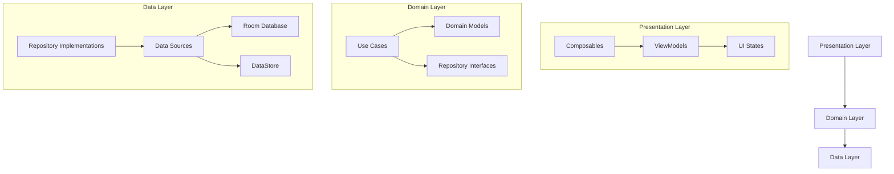
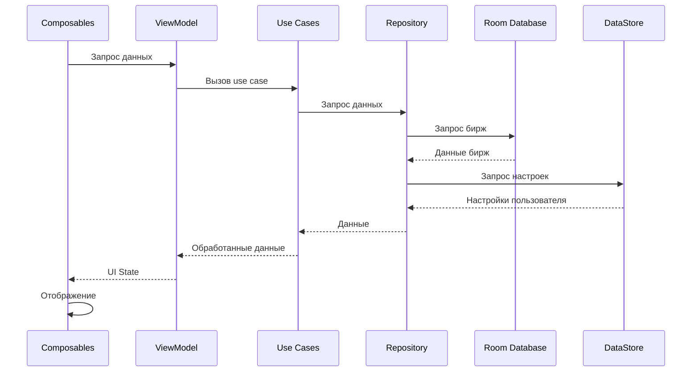

# План разработки приложения TradeClock для Android

## Рекомендуемая архитектура

Для разработки приложения TradeClock я рекомендую использовать **Clean Architecture** с **MVVM** паттерном для презентационного слоя. Эта архитектура обеспечит:

- Четкое разделение ответственности между компонентами
- Хорошую тестируемость
- Масштабируемость и поддержку будущих изменений
- Соответствие современным практикам Android-разработки

Архитектура будет состоять из трех основных слоев:



## Структура проекта

```
app/
├── src/
│   ├── main/
│   │   ├── java/com/example/tradeclock/
│   │   │   ├── data/                  # Слой данных
│   │   │   │   ├── database/          # Room база данных
│   │   │   │   ├── datastore/         # Настройки пользователя
│   │   │   │   ├── models/            # Модели данных
│   │   │   │   └── repositories/      # Реализации репозиториев
│   │   │   │
│   │   │   ├── domain/                # Бизнес-логика
│   │   │   │   ├── models/            # Доменные модели
│   │   │   │   ├── repositories/      # Интерфейсы репозиториев
│   │   │   │   └── usecases/          # Use cases
│   │   │   │
│   │   │   ├── presentation/          # UI слой
│   │   │   │   ├── components/        # Переиспользуемые компоненты UI
│   │   │   │   ├── screens/           # Экраны приложения
│   │   │   │   ├── theme/             # Тема приложения
│   │   │   │   └── viewmodels/        # ViewModels
│   │   │   │
│   │   │   ├── di/                    # Dependency Injection
│   │   │   └── utils/                 # Утилиты
│   │   │
│   │   ├── res/                       # Ресурсы
│   │   └── AndroidManifest.xml
│   │
│   └── test/                          # Unit тесты
│
├── build.gradle
└── ...
```

## Основные этапы разработки

### 1. Настройка проекта и базовая структура

- Создание нового проекта с Jetpack Compose
- Настройка зависимостей (Hilt, Room, Compose, DataStore)
- Создание базовой структуры пакетов
- Настройка темы приложения

### 2. Разработка слоя данных

- Создание моделей данных для бирж
- Настройка Room базы данных
- Реализация DataStore для хранения настроек пользователя
- Реализация репозиториев

### 3. Разработка доменного слоя

- Создание доменных моделей
- Разработка use cases для основных функций:
  - Получение списка бирж
  - Фильтрация бирж по настройкам пользователя
  - Расчет статуса биржи (открыта/закрыта)
  - Управление настройками пользователя

### 4. Разработка UI

- Создание основных экранов:
  - Главный экран со списком бирж
  - Экран настроек
- Разработка ViewModels для каждого экрана
- Создание переиспользуемых UI компонентов
- Реализация темной темы

### 5. Тестирование и оптимизация

- Написание unit-тестов
- UI тестирование
- Оптимизация производительности
- Проверка на различных устройствах

### 6. Подготовка к релизу

- Создание иконок и графических ресурсов
- Настройка подписи приложения
- Подготовка к публикации в Google Play

## Ключевые компоненты и их взаимодействие

### Модель данных биржи (Exchange)

```kotlin
// Доменная модель
data class Exchange(
    val id: String,
    val name: String,
    val timezone: ZoneId,
    val openingTime: LocalTime,
    val closingTime: LocalTime,
    val continent: String,
    val status: ExchangeStatus
)

enum class ExchangeStatus {
    OPEN,
    CLOSED
}
```

### Поток данных



## Технологический стек

| Компонент | Технология | Обоснование |
|-----------|------------|-------------|
| UI | Jetpack Compose | Современный декларативный подход к UI, официально рекомендуемый Google |
| Архитектура | Clean Architecture + MVVM | Разделение ответственности, тестируемость, масштабируемость |
| Состояние UI | StateFlow | Реактивный подход к управлению состоянием UI |
| Dependency Injection | Hilt | Упрощенная версия Dagger, официально поддерживаемая Google |
| База данных | Room | Абстракция над SQLite, интеграция с Kotlin Coroutines |
| Настройки | DataStore | Современная замена SharedPreferences с поддержкой Kotlin Flow |
| Работа со временем | java.time / ThreeTenABP | Надежная работа с часовыми поясами и временем |
| Асинхронность | Kotlin Coroutines + Flow | Реактивное программирование и асинхронные операции |
| Тестирование | JUnit, Mockito, Turbine | Комплексное тестирование всех слоев приложения |

## Рекомендации по реализации

1. **Инициализация базы данных**:
   - Создать предзаполненную базу данных с основными биржами
   - Использовать Room Database Callback для заполнения данных при первом запуске

2. **Расчет статуса биржи**:
   - Создать отдельный use case для расчета статуса биржи на основе текущего времени
   - Использовать java.time для корректной работы с часовыми поясами

3. **Обновление времени**:
   - Реализовать периодическое обновление статусов бирж (каждую минуту)
   - Использовать Flow для реактивного обновления UI

4. **UI**:
   - Использовать Material 3 компоненты
   - Реализовать адаптивный дизайн для различных размеров экрана
   - Обеспечить поддержку темной темы